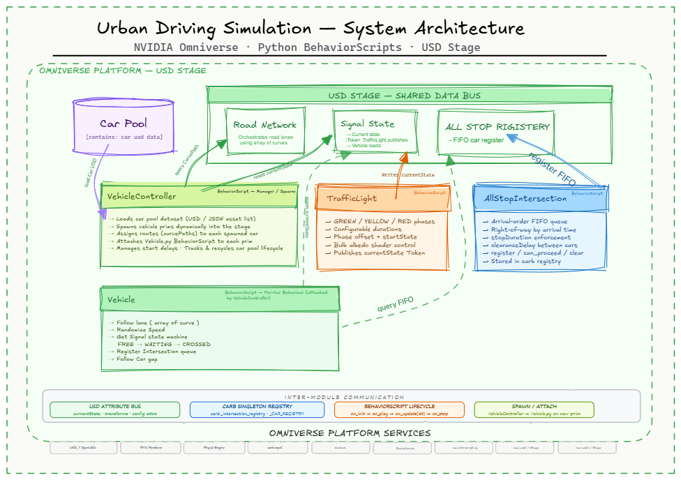

# 🚗 Urban Driving Simulation — NVIDIA Omniverse

> A fully modular, real-time urban traffic simulation built on **NVIDIA Omniverse** using **Python BehaviorScripts** and **USD (Universal Scene Description)** as a live shared data bus.

<br>

## 📋 Table of Contents

- [Step 1 — Run on NVIDIA Brev](#step-1--run-on-nvidia-brev)
- [Step 2 — Technical Architecture](#step-2--technical-architecture)
- [Module Reference](#module-reference)
- [USD Attributes Reference](#usd-attributes-reference)
- [Troubleshooting](#troubleshooting)
- [Roadmap](#roadmap)
- [License](#license)

---

## Step 1 — Run on NVIDIA Brev

This project runs on **NVIDIA Brev** — a cloud-hosted Omniverse environment accessible entirely from your browser. No local GPU setup required.

> 📌 Full Brev setup guide: [kit-app-template-launchable](https://github.com/aRathinasamy/kit-app-template-launchable/blob/main/README.md)

<br>

### 🚀 Deploy

1. Click **[Deploy Now](https://github.com/aRathinasamy/kit-app-template-launchable/blob/main/README.md)** to open the Brev Launchable
2. In Brev, click **Deploy Launchable** to spin up the instance
3. Wait until the instance is **fully ready** — status shows *running*, *built*, and setup script complete
   > ⏱️ The first launch can take several minutes as the environment builds
4. On the Brev instance page, scroll to **"Using Secure Links"**
5. Click the **arrow icon** next to the Shareable URL and log in with your **NVIDIA Brev account**

<br>

### 🛠️ Configure Kit App Template

Once inside the Visual Studio Code browser environment:

```bash
# Navigate to Kit App Template
cd kit-app-template

# Launch the configuration wizard
./repo.sh template new
```

Follow the prompts:

| Prompt | Value |
|---|---|
| What to create | `Application` |
| Template | `USD Composer` |
| Application name | *(your choice)* |
| Add application layers? | `Yes` |
| Toggle streaming layer | `omni_default_streaming` → Omniverse Kit App Streaming (Default) |

```bash
# Build the application
./repo.sh build

# Launch in headless / streaming mode
./repo.sh launch -- --no-window
# Select: ApplicationLayerTemplate [your_app_name]_streaming.kit
```

> ⚠️ Make sure to select the kit file with the **streaming application layer**

<br>

### 🖥️ Open the Viewer

Open a new browser tab and navigate to:

```
https://[your-brev-url]/viewer/
```

> **Example:** if VSCode is at `https://kat.brevlab-1234`, the viewer is at `https://kat.brevlab-1234/viewer/`

After a few seconds the Omniverse UI will appear. The first launch may take longer as shaders are cached. On subsequent relaunches, refresh the tab.

> ⚠️ Keep only **one viewer tab open** at a time for best results

---

## Step 2 — Technical Architecture



This simulation is composed of **six Python BehaviorScripts**, each attached to a USD prim in the Omniverse scene. They communicate exclusively through **USD attributes** and a **carb singleton registry** — no direct imports between scripts, no hard-coded dependencies.

### Core Design Principles

- **The USD Stage is the data bus.** Every piece of shared state — traffic light phase, road curves, spawn config — lives as a USD attribute on a prim. Any script can publish or subscribe to any attribute at any time.
- **The scene is the configuration.** You configure each module entirely through prim properties in the Omniverse UI — no code changes needed to add a new intersection, traffic light, or car type.
- **Scripts are decoupled by design.** VehicleController doesn't call Vehicle directly — it spawns a prim and attaches the script. TrafficLight doesn't know Vehicle exists — it just writes `currentState` to USD.

<br>

### Architecture Overview

```
┌─────────────────────────────────────────────────────────────────────┐
│                    OMNIVERSE PLATFORM — USD STAGE                   │
│                                                                     │
│        ┌──────────────────────────────────────────────┐            │
│        │         USD STAGE — SHARED DATA BUS          │            │
│        │  currentState · curvePaths · transforms      │            │
│        │  carPoolDataset · routeAssignment             │            │
│        └──────┬───────────────────┬──────────────────┘            │
│               │ writes            │ reads / writes                  │
│        ┌──────▼──────┐    ┌───────▼──────────────────┐            │
│        │ TrafficLight│    │   VehicleController       │            │
│        │   .py       │    │   (Manager / Spawner)     │◄── CarPool │
│        └─────────────┘    └───────┬──────────────────┘            │
│                                   │ spawns + attaches              │
│                          ┌────────▼──────────────────┐            │
│                          │       Vehicle.py           │            │
│                          │  (Per-Car Behaviour)       │──────────► │
│                          │  curve follow · signals    │  queries   │
│                          │  gap keeping · FSM         │  AllStop   │
│                          └────────────────────────────┘  Registry  │
│                                                                     │
│                          ┌────────────────────────────┐            │
│                          │       FreeCamera.py        │            │
│                          │  WASD · car-follow mode    │            │
│                          └────────────────────────────┘            │
└─────────────────────────────────────────────────────────────────────┘
```

---

## Module Reference

### 🟢 VehicleController.py — Manager / Spawner
> `BehaviorScript` attached to a root manager prim

VehicleController owns the **full lifecycle of all cars** in the scene. It never drives — that is Vehicle's job. It acts as a factory and pool manager:

- Loads the **Car Pool** (`car usd data`) — USD asset paths, vehicle types, speed profiles, mesh variants and route weights
- **Dynamically spawns** car prims into the USD Stage at runtime
- Assigns a **Road Network** (ordered array of BasisCurves) plus signal and intersection references to each spawned car
- **Attaches `Vehicle.py`** as a BehaviorScript to each new prim immediately after spawn
- Staggered `startDelay` prevents cars from overlapping at the spawn point
- **Recycles and despawns** cars that complete their route, returning them to the pool for continuous traffic flow

<br>

### 🟢 Vehicle.py — Per-Car Behaviour
> `BehaviorScript` automatically attached by VehicleController to each spawned car prim

Handles everything a single car does from the moment it enters the scene.

**Movement — Road Network**
- Follows an ordered array of **BasisCurves** splines as its road
- Chains multiple curves seamlessly with smooth segment interpolation
- Maintains **look-ahead orientation** so the car always faces its direction of travel
- **Randomised speed per seed** — every car draws independent speed and change intervals

**Traffic Logic — Signal State**
- Reads `currentState` Token directly from the TrafficLight prim via USD every frame
- **Signal stop FSM:** `FREE → WAITING → CROSSED`
  - Holds at stop line when state is RED or YELLOW
  - Proceeds when GREEN, resets on next loop

**Traffic Logic — All Stop Registry**
- Queries `AllStopIntersection` via `carb._intersection_registry`
- **Intersection FSM:** `FREE → WAITING → PROCEEDING → CROSSED`
- Registers arrival time, waits for right-of-way, proceeds when permitted

**Car Following — Follow Car Gap**
- Module-level `_CAR_REGISTRY` keyed per curve — every car on the same curve can see each other
- Three-zone gap behaviour: full speed → proportional slowdown → stop
- Optional **follow target mode**: trails another specific car by reading its world matrix

<br>

### 🟠 TrafficLight.py
> `BehaviorScript` attached to the traffic light root prim

- Cycles: **GREEN → YELLOW → RED → GREEN** with individually configurable durations
- Controls each bulb's colour via shader `diffuse_color_constant` — bulbs glow correctly under RTX lighting
- Writes `currentState` Token to its own prim on every phase transition
- `phaseOffset` and `startState` allow multiple intersections to be staggered without code changes

<br>

### 🔵 AllStopIntersection.py — All Stop Registry
> `BehaviorScript` attached to an intersection Xform prim

Manages right-of-way at all-way stop intersections using a FIFO queue:

- Maintains an **arrival-order queue** — first car to arrive gets right-of-way first
- Enforces minimum `stopDuration` (wait at line) and `clearanceDelay` (gap between departures)
- Exposes three public methods called by Vehicle scripts:
  - `register_arrival(prim_path, time)` — car announces itself
  - `can_proceed(prim_path, time) → bool` — car checks if it has right-of-way
  - `clear(prim_path, time)` — car signals it has cleared the intersection
- Instance stored in `carb._intersection_registry` — accessible by any Vehicle script in the scene

<br>

### 🟣 FreeCamera.py
> `BehaviorScript` attached to a Camera prim

Two modes, switched by a single USD attribute:

**Manual mode** (`followTargetPath` is empty)
- WASD + QE keyboard navigation via `carb.input` subscription
- Right mouse button look handled natively by Omniverse
- `Shift` for 3× speed

**Car-follow mode** (`followTargetPath` set to a vehicle prim path)
- Reads the target car's world matrix every frame
- Positions camera at: `car_pos + car_local_X * offsetX + world_Y * offsetY`
- Derives pitch + yaw from look-direction vector — camera always points naturally at the car
- `followSmoothing` lerp factor prevents jitter

---

## USD Attributes Reference

All inter-script state flows through USD attributes — no direct Python calls between scripts.

| Attribute | Prim | Written by | Read by |
|---|---|---|---|
| `currentState` (Token) | TrafficLight | `TrafficLight.py` | `Vehicle.py` |
| `curvePaths` (StringArray) | Vehicle | `VehicleController.py` | `Vehicle.py` |
| `translate / rotate` (XformOps) | Any | `Vehicle.py`, `FreeCamera.py` | `FreeCamera.py` |
| `carb._intersection_registry` | *(carb)* | `AllStopIntersection.py` | `Vehicle.py` |
| `_CAR_REGISTRY` | *(module)* | `Vehicle.py` | `Vehicle.py` |
| `carPoolDataset` | Manager | Scene setup | `VehicleController.py` |
| `routeAssignment` | Manager | `VehicleController.py` | `Vehicle.py` |

### Inter-Module Communication Summary

| Channel | Used by | Purpose |
|---|---|---|
| **USD Attribute Bus** | All scripts | `currentState`, transforms, config floats |
| **carb Singleton Registry** | Vehicle ↔ AllStopIntersection | FIFO queue queries |
| **Module-level `_CAR_REGISTRY`** | Vehicle ↔ Vehicle | Per-curve gap detection |
| **BehaviorScript Lifecycle** | All scripts | `on_init → on_play → on_update(dt) → on_stop` |
| **Spawn / Attach** | VehicleController → Vehicle | Dynamic prim creation + script attachment |

---

## Troubleshooting

**Containers not running on Brev**
```bash
docker ps                  # check which containers are running
docker compose down
docker compose up -d       # restart all containers
```
Expected containers: `web-viewer`, `vscode`, `dev-nginx-1`

**Viewer tab won't connect** — Make sure only one viewer tab is open. Refresh after restarting containers.

**Cars not stopping at intersection on second lap** — `_intersection_state` must reset to `FREE` at the loop boundary alongside `_stop_state`. Ensure you are on the latest `Vehicle.py`.

**Camera snapping back when rotating** — `FreeCamera.py` must not write rotation each frame. Older versions wrote a fixed `Y=-90` which conflicts with Omniverse's built-in right-click mouse look.

**Navigation speed too fast on Brev streaming** — Run `set_navigation_speed.py` in the Script Editor and set `ROTATION_SPEED = 0.3`.

---

## Roadmap

- [ ] Pedestrian agents with crosswalk awareness
- [ ] Emergency vehicle priority override
- [ ] Roundabout controller script
- [ ] Multi-lane roads with lane-change behaviour
- [ ] Synthetic data export for AV perception model training
- [ ] Real-world road network import via OpenStreetMap → USD

---

## License

By clicking "Deploy Launchable" you agree to the [NVIDIA Software License Agreement](https://github.com/NVIDIA-Omniverse/kit-app-template/blob/main/LICENSE).

---

> Built with **NVIDIA Omniverse** · **Python BehaviorScripts** · **OpenUSD**
